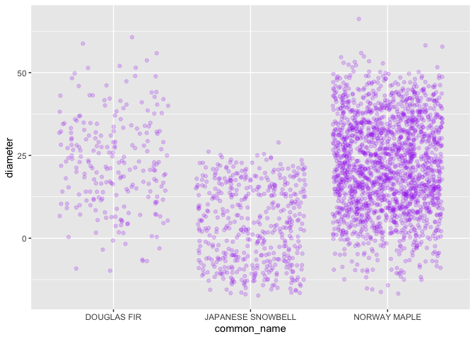
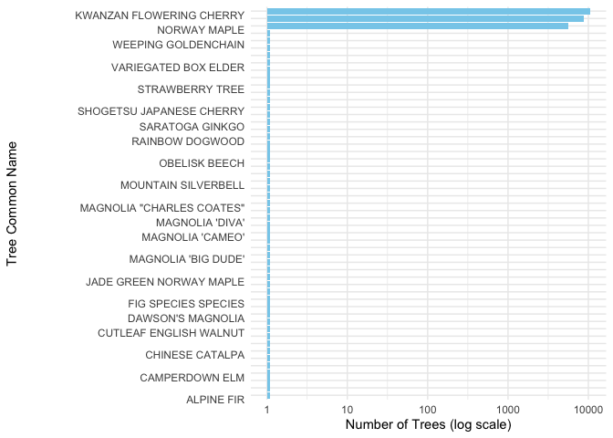
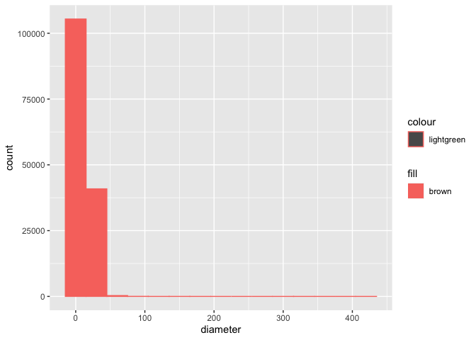
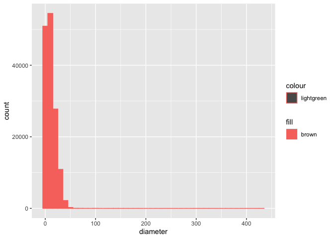
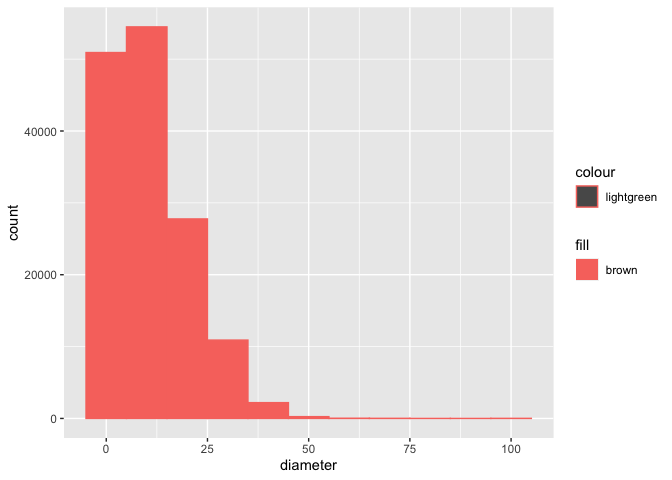
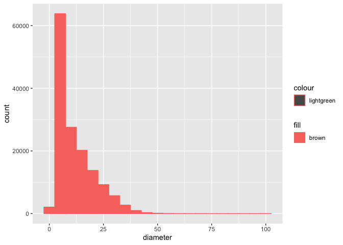
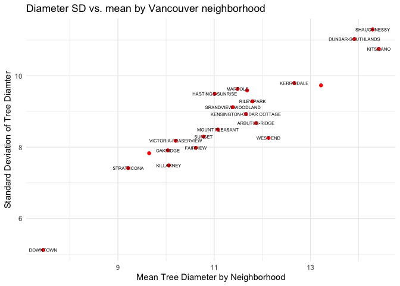

Mini Data Analysis Milestone 2
================

*To complete this milestone, you can either edit [this `.rmd`
file](https://raw.githubusercontent.com/UBC-STAT/stat545.stat.ubc.ca/master/content/mini-project/mini-project-2.Rmd)
directly. Fill in the sections that are commented out with
`<!--- start your work here--->`. When you are done, make sure to knit
to an `.md` file by changing the output in the YAML header to
`github_document`, before submitting a tagged release on canvas.*

# Welcome to the rest of your mini data analysis project!

In Milestone 1, you explored your data. and came up with research
questions. This time, we will finish up our mini data analysis and
obtain results for your data by:

- Making summary tables and graphs
- Manipulating special data types in R: factors and/or dates and times.
- Fitting a model object to your data, and extract a result.
- Reading and writing data as separate files.

We will also explore more in depth the concept of *tidy data.*

**NOTE**: The main purpose of the mini data analysis is to integrate
what you learn in class in an analysis. Although each milestone provides
a framework for you to conduct your analysis, it’s possible that you
might find the instructions too rigid for your data set. If this is the
case, you may deviate from the instructions – just make sure you’re
demonstrating a wide range of tools and techniques taught in this class.

# Instructions

**To complete this milestone**, edit [this very `.Rmd`
file](https://raw.githubusercontent.com/UBC-STAT/stat545.stat.ubc.ca/master/content/mini-project/mini-project-2.Rmd)
directly. Fill in the sections that are tagged with
`<!--- start your work here--->`.

**To submit this milestone**, make sure to knit this `.Rmd` file to an
`.md` file by changing the YAML output settings from
`output: html_document` to `output: github_document`. Commit and push
all of your work to your mini-analysis GitHub repository, and tag a
release on GitHub. Then, submit a link to your tagged release on canvas.

**Points**: This milestone is worth 50 points: 45 for your analysis, and
5 for overall reproducibility, cleanliness, and coherence of the Github
submission.

**Research Questions**: In Milestone 1, you chose two research questions
to focus on. Wherever realistic, your work in this milestone should
relate to these research questions whenever we ask for justification
behind your work. In the case that some tasks in this milestone don’t
align well with one of your research questions, feel free to discuss
your results in the context of a different research question.

# Learning Objectives

By the end of this milestone, you should:

- Understand what *tidy* data is, and how to create it using `tidyr`.
- Generate a reproducible and clear report using R Markdown.
- Manipulating special data types in R: factors and/or dates and times.
- Fitting a model object to your data, and extract a result.
- Reading and writing data as separate files.

# Setup

Begin by loading your data and the tidyverse package below:

``` r
library(datateachr) # <- might contain the data you picked!
library(tidyverse)
```

# Task 1: Process and summarize your data

From milestone 1, you should have an idea of the basic structure of your
dataset (e.g. number of rows and columns, class types, etc.). Here, we
will start investigating your data more in-depth using various data
manipulation functions.

### 1.1 (1 point)

First, write out the 4 research questions you defined in milestone 1
were. This will guide your work through milestone 2:

<!-------------------------- Start your work below ---------------------------->

1.  **WAS ALTERED FROM MDA 1 TO BETTER WORK WITH THE TASKS IN 1.2 AND
    FOR FURTHER RESEARCH:** How do tree species attributes
    (distribution, diameter, height, etc.) differ in the city of
    Vancouver?

2.  What is the most common tree found in Vancouver? How dominant is it
    compared to other species?

3.  What is the relationship between tree diameter and it’s age?

4.  Which neighborhood has the healthiest tree community? (This would
    need to consider tree species richness, number of trees, size
    distribution of trees, etc.)

<!----------------------------------------------------------------------------->

Here, we will investigate your data using various data manipulation and
graphing functions.

### 1.2 (8 points)

Now, for each of your four research questions, choose one task from
options 1-4 (summarizing), and one other task from 4-8 (graphing). You
should have 2 tasks done for each research question (8 total). Make sure
it makes sense to do them! (e.g. don’t use a numerical variables for a
task that needs a categorical variable.). Comment on why each task helps
(or doesn’t!) answer the corresponding research question.

Ensure that the output of each operation is printed!

Also make sure that you’re using dplyr and ggplot2 rather than base R.
Outside of this project, you may find that you prefer using base R
functions for certain tasks, and that’s just fine! But part of this
project is for you to practice the tools we learned in class, which is
dplyr and ggplot2.

**Summarizing:**

1.  Compute the *range*, *mean*, and *two other summary statistics* of
    **one numerical variable** across the groups of **one categorical
    variable** from your data.
2.  Compute the number of observations for at least one of your
    categorical variables. Do not use the function `table()`!
3.  Create a categorical variable with 3 or more groups from an existing
    numerical variable. You can use this new variable in the other
    tasks! *An example: age in years into “child, teen, adult, senior”.*
4.  Compute the proportion and counts in each category of one
    categorical variable across the groups of another categorical
    variable from your data. Do not use the function `table()`!

**Graphing:**

6.  Create a graph of your choosing, make one of the axes logarithmic,
    and format the axes labels so that they are “pretty” or easier to
    read.
7.  Make a graph where it makes sense to customize the alpha
    transparency.

Using variables and/or tables you made in one of the “Summarizing”
tasks:

8.  Create a graph that has at least two geom layers.
9.  Create 3 histograms, with each histogram having different sized
    bins. Pick the “best” one and explain why it is the best.

Make sure it’s clear what research question you are doing each operation
for!

<!------------------------- Start your work below ----------------------------->

``` r
# recalling the dataset vancouver_trees, as I need to refresh what the columns and rows look like, using glimpse() from dplyr

glimpse(vancouver_trees)
```

    ## Rows: 146,611
    ## Columns: 20
    ## $ tree_id            <dbl> 149556, 149563, 149579, 149590, 149604, 149616, 149…
    ## $ civic_number       <dbl> 494, 450, 4994, 858, 5032, 585, 4909, 4925, 4969, 7…
    ## $ std_street         <chr> "W 58TH AV", "W 58TH AV", "WINDSOR ST", "E 39TH AV"…
    ## $ genus_name         <chr> "ULMUS", "ZELKOVA", "STYRAX", "FRAXINUS", "ACER", "…
    ## $ species_name       <chr> "AMERICANA", "SERRATA", "JAPONICA", "AMERICANA", "C…
    ## $ cultivar_name      <chr> "BRANDON", NA, NA, "AUTUMN APPLAUSE", NA, "CHANTICL…
    ## $ common_name        <chr> "BRANDON ELM", "JAPANESE ZELKOVA", "JAPANESE SNOWBE…
    ## $ assigned           <chr> "N", "N", "N", "Y", "N", "N", "N", "N", "N", "N", "…
    ## $ root_barrier       <chr> "N", "N", "N", "N", "N", "N", "N", "N", "N", "N", "…
    ## $ plant_area         <chr> "N", "N", "4", "4", "4", "B", "6", "6", "3", "3", "…
    ## $ on_street_block    <dbl> 400, 400, 4900, 800, 5000, 500, 4900, 4900, 4900, 7…
    ## $ on_street          <chr> "W 58TH AV", "W 58TH AV", "WINDSOR ST", "E 39TH AV"…
    ## $ neighbourhood_name <chr> "MARPOLE", "MARPOLE", "KENSINGTON-CEDAR COTTAGE", "…
    ## $ street_side_name   <chr> "EVEN", "EVEN", "EVEN", "EVEN", "EVEN", "ODD", "ODD…
    ## $ height_range_id    <dbl> 2, 4, 3, 4, 2, 2, 3, 3, 2, 2, 2, 5, 3, 2, 2, 2, 2, …
    ## $ diameter           <dbl> 10.00, 10.00, 4.00, 18.00, 9.00, 5.00, 15.00, 14.00…
    ## $ curb               <chr> "N", "N", "Y", "Y", "Y", "Y", "Y", "Y", "Y", "Y", "…
    ## $ date_planted       <date> 1999-01-13, 1996-05-31, 1993-11-22, 1996-04-29, 19…
    ## $ longitude          <dbl> -123.1161, -123.1147, -123.0846, -123.0870, -123.08…
    ## $ latitude           <dbl> 49.21776, 49.21776, 49.23938, 49.23469, 49.23894, 4…

## **Research Question 1:** How do tree species attributes (distribution, diameter, height, etc.) differ in the city of Vancouver?

For **summarizing activities**, will complete **Task 4: Compute the
proportion and counts in each category of one categorical variable
across the groups of another categorical variable from your data. Do not
use the function `table()`!**. I will compare the counts and proportions
of the number of neighbourhoods a particular tree species occurs within
using the categorical variables common_name and neighborhood_name. This
will be beneficial towards answering my research question, as
understanding how a particular tree species is distributed across the
city, whether it be evenly or unevenly, is an important attribute of the
tree species. It helps us to picture where exactly this tree occurs
within the city and to think about why that might be.

``` r
# total number of tree species in all of the City of Vancouver

total_tree_sp_vancouver <- vancouver_trees %>%
  distinct(common_name) %>%
  count()
  
total_tree_sp_vancouver
```

    ## # A tibble: 1 × 1
    ##       n
    ##   <int>
    ## 1   634

``` r
# there are 634 tree species in the City of Vancouver

# now to determine the number of neighbourhoods in which each tree species occurs

neighborhoods_per_tree_sp <- vancouver_trees %>%
  group_by(common_name) %>%
  count(neighbourhood_name)

neighborhoods_per_tree_sp
```

    ## # A tibble: 6,141 × 3
    ## # Groups:   common_name [634]
    ##    common_name     neighbourhood_name      n
    ##    <chr>           <chr>               <int>
    ##  1 ACCOLADE CHERRY ARBUTUS-RIDGE           1
    ##  2 ACCOLADE CHERRY DOWNTOWN                6
    ##  3 ACCOLADE CHERRY FAIRVIEW                2
    ##  4 ACCOLADE CHERRY GRANDVIEW-WOODLAND      3
    ##  5 ACCOLADE CHERRY HASTINGS-SUNRISE       30
    ##  6 ACCOLADE CHERRY KERRISDALE              4
    ##  7 ACCOLADE CHERRY KITSILANO               4
    ##  8 ACCOLADE CHERRY SHAUGHNESSY             4
    ##  9 ACCOLADE CHERRY STRATHCONA              1
    ## 10 ACCOLADE CHERRY VICTORIA-FRASERVIEW     3
    ## # ℹ 6,131 more rows

``` r
# now to calculate the proportion of trees in each neighborhood for a specific tree species, the Accolade cherry, using filter() and mutate() from dplyr

proportions <- neighborhoods_per_tree_sp %>%
  filter(common_name == "ACCOLADE CHERRY") %>%
  mutate(freq = n/sum(n))

proportions
```

    ## # A tibble: 11 × 4
    ## # Groups:   common_name [1]
    ##    common_name     neighbourhood_name      n   freq
    ##    <chr>           <chr>               <int>  <dbl>
    ##  1 ACCOLADE CHERRY ARBUTUS-RIDGE           1 0.0167
    ##  2 ACCOLADE CHERRY DOWNTOWN                6 0.1   
    ##  3 ACCOLADE CHERRY FAIRVIEW                2 0.0333
    ##  4 ACCOLADE CHERRY GRANDVIEW-WOODLAND      3 0.05  
    ##  5 ACCOLADE CHERRY HASTINGS-SUNRISE       30 0.5   
    ##  6 ACCOLADE CHERRY KERRISDALE              4 0.0667
    ##  7 ACCOLADE CHERRY KITSILANO               4 0.0667
    ##  8 ACCOLADE CHERRY SHAUGHNESSY             4 0.0667
    ##  9 ACCOLADE CHERRY STRATHCONA              1 0.0167
    ## 10 ACCOLADE CHERRY VICTORIA-FRASERVIEW     3 0.05  
    ## 11 ACCOLADE CHERRY WEST END                2 0.0333

``` r
#there, now we can see the relative proportions in the freq column of the tibble for each neighbourhood that this tree species is found in. For example, we can see that half of the Accolade cherry trees in the city are found in the Hastings-Sunrise neighbourhood!

# Just to confirm that our freq column is accurate, let's make sure all of the proportions sum to 1.

sum(proportions$freq)
```

    ## [1] 1

``` r
# great, it does sum to 1, hence these proportions are accurate.
```

For **graphing activities** for research question 1, I will complete
**Task 7: Make a graph where it makes sense to customize the alpha
transparency.** For this, I will create a jitter plot that compares the
spread of tree diameter values in three specific tree species - the
Japanese snowbell, Norway maple, and Douglas fir trees - in Vancouver.
You can gather much more information from jitter plots when they have a
low alpha transparency - it allows you to see where values are
clustering and where they are more spread out. This will be helpful for
research question 1 because it visualizes and compares how an important
tree attribute (diameter) differs between species within the City of
Vancouver.

``` r
# using filter() from dplyr and ggplot with geom_jitter() function from ggplot2, we will create this plot. 

three_tree_sp_in_vancouver <- vancouver_trees %>%
  filter(common_name == c("JAPANESE SNOWBELL", "NORWAY MAPLE", "DOUGLAS FIR"))
```

    ## Warning: There was 1 warning in `filter()`.
    ## ℹ In argument: `common_name == c("JAPANESE SNOWBELL", "NORWAY MAPLE", "DOUGLAS
    ##   FIR")`.
    ## Caused by warning in `common_name == c("JAPANESE SNOWBELL", "NORWAY MAPLE", "DOUGLAS FIR")`:
    ## ! longer object length is not a multiple of shorter object length

``` r
three_tree_sp_in_vancouver
```

    ## # A tibble: 2,548 × 20
    ##    tree_id civic_number std_street       genus_name species_name cultivar_name
    ##      <dbl>        <dbl> <chr>            <chr>      <chr>        <chr>        
    ##  1  149658         5208 WINDSOR ST       STYRAX     JAPONICA     <NA>         
    ##  2  155358         1451 WILLIAM ST       ACER       PLATANOIDES  <NA>         
    ##  3  155498         4199 GLADSTONE ST     ACER       PLATANOIDES  <NA>         
    ##  4  155827         2796 ADANAC ST        ACER       PLATANOIDES  <NA>         
    ##  5  157393         1671 W KING EDWARD AV STYRAX     JAPONICA     <NA>         
    ##  6  158114         1610 BALSAM ST        ACER       PLATANOIDES  <NA>         
    ##  7  159009         3989 ANGUS DRIVE      STYRAX     JAPONICA     <NA>         
    ##  8  160040         4362 W 2ND AV         STYRAX     JAPONICA     <NA>         
    ##  9  160106         2280 E 49TH AV        ACER       PLATANOIDES  <NA>         
    ## 10  160900         1466 W 4TH AV         STYRAX     JAPONICA     <NA>         
    ## # ℹ 2,538 more rows
    ## # ℹ 14 more variables: common_name <chr>, assigned <chr>, root_barrier <chr>,
    ## #   plant_area <chr>, on_street_block <dbl>, on_street <chr>,
    ## #   neighbourhood_name <chr>, street_side_name <chr>, height_range_id <dbl>,
    ## #   diameter <dbl>, curb <chr>, date_planted <date>, longitude <dbl>,
    ## #   latitude <dbl>

``` r
tree_sp_vs_diameter <- three_tree_sp_in_vancouver %>%
  ggplot(aes(common_name, diameter)) +
  geom_jitter(height = 20, color = "purple", alpha = 0.2)

tree_sp_vs_diameter
```

<!-- -->

``` r
# from this plot, we can see that Douglas firs and Norway maples have similar height distributions, but that Norway maples are far more numerous in the city than Douglas firs (interesting, considering which one is the native species!). We can also tell that Japanese snowbell is more numerous than Douglas fir but less numerous than Norway maple, and has a generally smaller diameter than both of these trees with less spread in diameter values.
```

## **Research Question 2:** What is the most common tree found in Vancouver? How dominant is it compared to other species?

From **summarizing activities**, I will complete **Task 2: Compute the
number of observations for at least one of your categorical variables**
and compute the number of observations per tree species using
common_name, a categorical variable, in Metro Vancouver and sort them in
descending order from most to least common, based on the number of
observations per tree species. This will essentially answer my research
question.

``` r
# getting and ordering from high to low a count of the number of observations per unique common_name and sorting in descending order using dplyr function count() and arrange()

tree_count_by_species <- vancouver_trees %>% 
  count(common_name)
  
as_tibble(tree_count_by_species)
```

    ## # A tibble: 634 × 2
    ##    common_name                   n
    ##    <chr>                     <int>
    ##  1 ACCOLADE CHERRY              60
    ##  2 AKEBONO FLOWERING CHERRY   2384
    ##  3 ALDER SPECIES                16
    ##  4 ALDERLEAFED MOUNTAIN ASH    172
    ##  5 ALIA'S MAGNOLIA               3
    ##  6 ALLEGHENY SERVICEBERRY        6
    ##  7 ALLGOLD EUROPEAN ASH         78
    ##  8 ALMIRA NORWAY MAPLE           9
    ##  9 ALPINE FIR                    1
    ## 10 AMANOGAWA JAPANESE CHERRY    68
    ## # ℹ 624 more rows

``` r
tree_count_by_species_high_to_low <- tree_count_by_species %>%
  arrange(desc(n))

tree_count_by_species_high_to_low
```

    ## # A tibble: 634 × 2
    ##    common_name                     n
    ##    <chr>                       <int>
    ##  1 KWANZAN FLOWERING CHERRY    10529
    ##  2 PISSARD PLUM                 8692
    ##  3 NORWAY MAPLE                 5614
    ##  4 CRIMEAN LINDEN               4427
    ##  5 PYRAMIDAL EUROPEAN HORNBEAM  3409
    ##  6 NIGHT PURPLE LEAF PLUM       3250
    ##  7 RED MAPLE                    2806
    ##  8 KOBUS MAGNOLIA               2688
    ##  9 BOWHALL RED MAPLE            2622
    ## 10 AKEBONO FLOWERING CHERRY     2384
    ## # ℹ 624 more rows

``` r
# from this, we can determine that the most common tree in the City of Vancouver is the Kwanzan Flowering Cherry tree! It outnumbers the Pissard plum tree, the second most common tree, by almost 2000 trees.
```

From **graphing activities**, I will complete **Task 6: Create a graph
of your choosing, make one of the axes logarithmic, and format the axes
labels so that they are “pretty” or easier to read.** I will make a bar
graph depicting what I discovered above, visualizing the counts of trees
by species. There are counts ranging from 10,000+ trees to 1 tree, so a
logarithmic scale will be beneficial to aid in a better visualization
and to help understand the spread of our data. This plot will be helpful
for my research question as it will help in visually comparing how
dominant the most common tree species is in the city of Vancouver.

``` r
# creating a bar plot with a logarithmic scale with ggplot2 and the geom_col() function to depict tree counts by species in the city of Metro Vancouver.

# Let's also reduce the number of species we are comparing, since showing 634 bars on a graph is not going to look pretty. Let's get only the observations where there are greater than 5000 individuals per species or less than 2 individuals per species. I will use the filter() function prior to the ggplot function to do this.

most_and_least_abndt_trees <- tree_count_by_species %>%
  filter(n > 5000 | n < 2) %>%
  ggplot( aes(y = reorder(common_name, n), x = n)) +
  geom_col(fill = "skyblue") +
  scale_x_log10() +
  labs(y = "Tree Common Name", x = "Number of Trees (log scale)") +
  theme_minimal() +
  theme(axis.text.y = element_text(angle = 0, vjust = 1, hjust = 1)) +
  guides(y = guide_axis(check.overlap = TRUE))

most_and_least_abndt_trees
```

<!-- -->

``` r
# Here we can see that there are only a handful of species (3) that have tree counts above 5000 trees, while there are many species that only have 1 tree in the entire City of Vancouver dataset!
```

## **Research Question 3:** What is the relationship between tree diameter and it’s age?

From **summarizing activities**, I will complete **Task 3: Create a
categorical variable with 3 or more groups from an existing numerical
variable.** I will create a categorical variable titled
“trunk_thickness” from “diameter”, with categories very thin, thin,
moderately thin, moderately thick, thick, very thick. This will help as
we can gain a better understanding of the actual thickness of these tree
trunks, rather than just looking at numbers that don’t give a good
visual. We can later plot this against age to gain a clear picture of
the relationship.

``` r
# Creating categorical variable trunk_thickness from diameter with 6 categories

# Let's determine min, max and mean for the diameter values first using the dplyr function summarize()

min_max_mean_diameter <- vancouver_trees %>% summarize(max = max(diameter), min = min(diameter), mean = mean(diameter))

min_max_mean_diameter
```

    ## # A tibble: 1 × 3
    ##     max   min  mean
    ##   <dbl> <dbl> <dbl>
    ## 1   435     0  11.5

``` r
vancouver_trees
```

    ## # A tibble: 146,611 × 20
    ##    tree_id civic_number std_street    genus_name species_name cultivar_name  
    ##      <dbl>        <dbl> <chr>         <chr>      <chr>        <chr>          
    ##  1  149556          494 W 58TH AV     ULMUS      AMERICANA    BRANDON        
    ##  2  149563          450 W 58TH AV     ZELKOVA    SERRATA      <NA>           
    ##  3  149579         4994 WINDSOR ST    STYRAX     JAPONICA     <NA>           
    ##  4  149590          858 E 39TH AV     FRAXINUS   AMERICANA    AUTUMN APPLAUSE
    ##  5  149604         5032 WINDSOR ST    ACER       CAMPESTRE    <NA>           
    ##  6  149616          585 W 61ST AV     PYRUS      CALLERYANA   CHANTICLEER    
    ##  7  149617         4909 SHERBROOKE ST ACER       PLATANOIDES  COLUMNARE      
    ##  8  149618         4925 SHERBROOKE ST ACER       PLATANOIDES  COLUMNARE      
    ##  9  149619         4969 SHERBROOKE ST ACER       PLATANOIDES  COLUMNARE      
    ## 10  149625          720 E 39TH AV     FRAXINUS   AMERICANA    AUTUMN APPLAUSE
    ## # ℹ 146,601 more rows
    ## # ℹ 14 more variables: common_name <chr>, assigned <chr>, root_barrier <chr>,
    ## #   plant_area <chr>, on_street_block <dbl>, on_street <chr>,
    ## #   neighbourhood_name <chr>, street_side_name <chr>, height_range_id <dbl>,
    ## #   diameter <dbl>, curb <chr>, date_planted <date>, longitude <dbl>,
    ## #   latitude <dbl>

``` r
# While we have a large spread of data, the mean is quite low (11.49 inches). Taking a look at the values in the diameter column, they seem to range between 18 and 3 mostly, so a max of 435 inches is likely an outlier (and, coming from a Forestry background, 435 inches as the DBH of a tree is near impossible!! So likely a flaw in the data). 

# From this information, I will separate by:
# Very thin = diameter < 1
# Thin = diameter < 3
# Moderately thin < 9
# Moderately thick < 12
# Thick < 15
# Very thick > 15
# using dplyr function mutate()

vancouver_trees_trunk_thickness <- vancouver_trees %>% 
  mutate(trunk_thickness=cut(diameter, breaks=c(-Inf, 1, 3, 9, 12, 15, Inf), labels=c("Very thin","Thin","Moderately thin", "Moderately thick", "Thick", "Very thick")))

vancouver_trees_trunk_thickness
```

    ## # A tibble: 146,611 × 21
    ##    tree_id civic_number std_street    genus_name species_name cultivar_name  
    ##      <dbl>        <dbl> <chr>         <chr>      <chr>        <chr>          
    ##  1  149556          494 W 58TH AV     ULMUS      AMERICANA    BRANDON        
    ##  2  149563          450 W 58TH AV     ZELKOVA    SERRATA      <NA>           
    ##  3  149579         4994 WINDSOR ST    STYRAX     JAPONICA     <NA>           
    ##  4  149590          858 E 39TH AV     FRAXINUS   AMERICANA    AUTUMN APPLAUSE
    ##  5  149604         5032 WINDSOR ST    ACER       CAMPESTRE    <NA>           
    ##  6  149616          585 W 61ST AV     PYRUS      CALLERYANA   CHANTICLEER    
    ##  7  149617         4909 SHERBROOKE ST ACER       PLATANOIDES  COLUMNARE      
    ##  8  149618         4925 SHERBROOKE ST ACER       PLATANOIDES  COLUMNARE      
    ##  9  149619         4969 SHERBROOKE ST ACER       PLATANOIDES  COLUMNARE      
    ## 10  149625          720 E 39TH AV     FRAXINUS   AMERICANA    AUTUMN APPLAUSE
    ## # ℹ 146,601 more rows
    ## # ℹ 15 more variables: common_name <chr>, assigned <chr>, root_barrier <chr>,
    ## #   plant_area <chr>, on_street_block <dbl>, on_street <chr>,
    ## #   neighbourhood_name <chr>, street_side_name <chr>, height_range_id <dbl>,
    ## #   diameter <dbl>, curb <chr>, date_planted <date>, longitude <dbl>,
    ## #   latitude <dbl>, trunk_thickness <fct>

``` r
# Now we have the trunk_thickness column added to the dataset.
```

For **graphing activities**, I will complete **Task 9: Create 3
histograms, with each histogram having different sized bins. Pick the
“best” one and explain why it is the best.** The diameter data had an
interesting spread, so before further probing the data to compare age
vs. diameter it would be good to determine if there are dramatic
outliers, and to determine how well I separated the trunk thickness
categories above, which will be important when we get to graphing the
relationship between tree diameter and age.

``` r
# Histogram #1: Bin size of 30 using ggplot and geom_histogram() from ggplot2

tree_diameter_histogram_bin30 <- vancouver_trees_trunk_thickness %>%
  ggplot(aes(diameter, color = "lightgreen", fill = "brown")) +
  geom_histogram(binwidth = 30)

tree_diameter_histogram_bin30 
```

<!-- -->

``` r
# This is not great, and it shows us that most of the diameter values are below 100 inches. We can try another bin size, perhaps a smaller bin size, say 10.

tree_diameter_histogram_bin10 <- vancouver_trees_trunk_thickness %>%
  ggplot(aes(diameter, color = "lightgreen", fill = "brown")) +
  geom_histogram(binwidth = 10)

tree_diameter_histogram_bin10 
```

<!-- -->

``` r
# here we can see even more prominently that the data is mostly concentrated below a diameter of 25 inches. Let's quickly try to remove these outliers in the data and see if that makes a difference. We will determine major outliers using filter() from dplyr

outliers <- vancouver_trees_trunk_thickness %>% filter(diameter > 100)

outliers
```

    ## # A tibble: 10 × 21
    ##    tree_id civic_number std_street   genus_name     species_name cultivar_name
    ##      <dbl>        <dbl> <chr>        <chr>          <chr>        <chr>        
    ##  1  182674         1488 E 64TH AV    ULMUS          AMERICANA    BRANDON      
    ##  2  184211         4210 W 16TH AV    QUERCUS        PHELLOS      <NA>         
    ##  3   23759          554 W 22ND AV    PRUNUS         SERRULATA    KWANZAN      
    ##  4   51001          849 W 60TH AV    ACER           SACCHARINUM  <NA>         
    ##  5   84751         8250 HUDSON ST    ACER           PLATANOIDES  <NA>         
    ##  6  199599         1194 ROSSLAND ST  STYRAX         JAPONICA     <NA>         
    ##  7  117345         7615 VIVIAN DRIVE CERCIDIPHYLLUM JAPONICUM    <NA>         
    ##  8   54498         6611 ADERA ST     ACER           PLATANOIDES  SCHWEDLERI   
    ##  9   78588         1333 W GEORGIA ST ACER           RUBRUM       <NA>         
    ## 10  149285         1906 W 14TH AV    ACER           SPECIES      <NA>         
    ## # ℹ 15 more variables: common_name <chr>, assigned <chr>, root_barrier <chr>,
    ## #   plant_area <chr>, on_street_block <dbl>, on_street <chr>,
    ## #   neighbourhood_name <chr>, street_side_name <chr>, height_range_id <dbl>,
    ## #   diameter <dbl>, curb <chr>, date_planted <date>, longitude <dbl>,
    ## #   latitude <dbl>, trunk_thickness <fct>

``` r
# there are only 10 trees that have a diameter greater than 100 inches - and these are likely incorrect measurements in some way (wrong unit, etc.). This is made clear by the date planted - some of the largest trees were planted only 20 years ago! This level of growth is completely impossible. I will filter these out of the data set with filter().

vancouver_trees_minus_outliers <- vancouver_trees_trunk_thickness %>% filter(diameter < 100)

vancouver_trees_minus_outliers
```

    ## # A tibble: 146,601 × 21
    ##    tree_id civic_number std_street    genus_name species_name cultivar_name  
    ##      <dbl>        <dbl> <chr>         <chr>      <chr>        <chr>          
    ##  1  149556          494 W 58TH AV     ULMUS      AMERICANA    BRANDON        
    ##  2  149563          450 W 58TH AV     ZELKOVA    SERRATA      <NA>           
    ##  3  149579         4994 WINDSOR ST    STYRAX     JAPONICA     <NA>           
    ##  4  149590          858 E 39TH AV     FRAXINUS   AMERICANA    AUTUMN APPLAUSE
    ##  5  149604         5032 WINDSOR ST    ACER       CAMPESTRE    <NA>           
    ##  6  149616          585 W 61ST AV     PYRUS      CALLERYANA   CHANTICLEER    
    ##  7  149617         4909 SHERBROOKE ST ACER       PLATANOIDES  COLUMNARE      
    ##  8  149618         4925 SHERBROOKE ST ACER       PLATANOIDES  COLUMNARE      
    ##  9  149619         4969 SHERBROOKE ST ACER       PLATANOIDES  COLUMNARE      
    ## 10  149625          720 E 39TH AV     FRAXINUS   AMERICANA    AUTUMN APPLAUSE
    ## # ℹ 146,591 more rows
    ## # ℹ 15 more variables: common_name <chr>, assigned <chr>, root_barrier <chr>,
    ## #   plant_area <chr>, on_street_block <dbl>, on_street <chr>,
    ## #   neighbourhood_name <chr>, street_side_name <chr>, height_range_id <dbl>,
    ## #   diameter <dbl>, curb <chr>, date_planted <date>, longitude <dbl>,
    ## #   latitude <dbl>, trunk_thickness <fct>

``` r
# Now, let's try that histogram with bin width 10 again!

tree_diameter_no_outliers_histogram_bin10 <- vancouver_trees_minus_outliers %>%
  ggplot(aes(diameter, color = "lightgreen", fill = "brown")) +
  geom_histogram(binwidth = 10)

tree_diameter_no_outliers_histogram_bin10
```

<!-- -->

``` r
# Better, but I think the bin width should still be lower. Let's try 5.

tree_diameter_no_outliers_histogram_bin5 <- vancouver_trees_minus_outliers %>%
  ggplot(aes(diameter, color = "lightgreen", fill = "brown")) +
  geom_histogram(binwidth = 5)

tree_diameter_no_outliers_histogram_bin5
```

<!-- -->

``` r
# Nice! This looks pretty good. This last histogram with a bin width of 5 is the best, as it shows a clear distribution of the diameters into reasonably-sized bins and a reasonable number of bins - not too many, not too few.
```

## **Research Question 4:** Which neighborhood has the healthiest tree community? (This would need to consider tree species richness, number of trees, size distribution of trees, etc.)

From **summarizing activities**, I will be completing **Task 1: Compute
the *range*, *mean*, and *two other summary statistics* of one numerical
variable across the groups of one categorical variable from your data.**
I will compute the range, mean, standard deviation and median values for
tree diameter (which I partially did with mean as an aside for Research
Question 3 above) - there aren’t many numerical variables in this
dataset, and the statistics from these diameter measurements will be a
very valuable indicator of the complexity and thus health of Vancouver
tree communities.

``` r
# calculating the mean, range, standard deviation and median for each neighborhood's tree diameter measurements using group_by() and summarize() functions from dplyr

diameter_summary_stats <- vancouver_trees %>%
  group_by(neighbourhood_name) %>%
  summarize(mean = mean(diameter), range = range(diameter), median = median(diameter), sd = sd(diameter))
```

    ## Warning: Returning more (or less) than 1 row per `summarise()` group was deprecated in
    ## dplyr 1.1.0.
    ## ℹ Please use `reframe()` instead.
    ## ℹ When switching from `summarise()` to `reframe()`, remember that `reframe()`
    ##   always returns an ungrouped data frame and adjust accordingly.
    ## Call `lifecycle::last_lifecycle_warnings()` to see where this warning was
    ## generated.

    ## `summarise()` has grouped output by 'neighbourhood_name'. You can override
    ## using the `.groups` argument.

``` r
diameter_summary_stats
```

    ## # A tibble: 44 × 5
    ## # Groups:   neighbourhood_name [22]
    ##    neighbourhood_name  mean  range median    sd
    ##    <chr>              <dbl>  <dbl>  <dbl> <dbl>
    ##  1 ARBUTUS-RIDGE      11.9    0      10    8.67
    ##  2 ARBUTUS-RIDGE      11.9   62      10    8.67
    ##  3 DOWNTOWN            7.45   1       6    5.12
    ##  4 DOWNTOWN            7.45 151       6    5.12
    ##  5 DUNBAR-SOUTHLANDS  13.9    0      12   11.0 
    ##  6 DUNBAR-SOUTHLANDS  13.9  305      12   11.0 
    ##  7 FAIRVIEW           10.6    1.25    9    7.98
    ##  8 FAIRVIEW           10.6   99       9    7.98
    ##  9 GRANDVIEW-WOODLAND 11.4    0       8.5  9.12
    ## 10 GRANDVIEW-WOODLAND 11.4   63       8.5  9.12
    ## # ℹ 34 more rows

From **graphing activities**, I will be completing **Task 8: Create a
graph that has at least two geom layers.** I will use the tibble made
above to plot the standard deviation of tree diameter by mean tree
diameter for each neighbourhood in a graph with points to indicate where
each neighbourhood falls along the plot. This will be an interesting
relationship to visualize, to see how mean diameter correlates with the
variation in our diameter datasets and how this compares across
neigbourhoods. This aid in answering research question 4 as it will
visualize certain aspects of tree community health (how big the trees
are, and how much their diameters vary) and the relationship between
them.

``` r
# using ggplot2 and the geom_line(), geom_text() and geom_point() functions, we will plot the relationship between the standard deviation of tree diameter and the mean tree diameter for each Vancouver neighbourhood.

diam_mean_vs_sd_nbhd <- diameter_summary_stats %>%
  ggplot(aes(mean, sd, label = neighbourhood_name)) +
  geom_point(color = "red") +
  geom_text(check_overlap = TRUE, size = 2) +
  theme_minimal() +
  labs(x = "Mean Tree Diameter by Neighborhood", y = "Standard Deviation of Tree Diamter", title = "Diameter SD vs. mean by Vancouver neighborhood")

diam_mean_vs_sd_nbhd
```

<!-- -->

``` r
# interesting! SD generally appears to increase as tree diameter increases. Note the spread of the extreme values and which neighbourhoods they correspond too - downtown has very small trees with little variability in size, which makes sense to me.
```

<!----------------------------------------------------------------------------->

### 1.3 (2 points)

Based on the operations that you’ve completed, how much closer are you
to answering your research questions? Think about what aspects of your
research questions remain unclear. Can your research questions be
refined, now that you’ve investigated your data a bit more? Which
research questions are yielding interesting results?

<!------------------------- Write your answer here ---------------------------->

### Research Question 1: How do tree species attributes (distribution, diameter, height, etc.) differ in the city of Vancouver?

This question I made some progress towards - I have created a tibble
with all of the tree species and which neighborhoods they occur in,
which I can use for plotting to visualize their distributions across the
city. I have also been able to calculate for a single tree species the
relative proportions of their populations by neighborhood, another good
measure of species distribution, and this calculation can be easily used
on any of the tree species in the city. I have also compared the
diameter of three tree species to gain a sense of how these species
attributes differ within and between species in regards to this
variable.

There is still much to investigate though. Relationships between height
and tree species, height and diameter and latitude and longitude of tree
species would all be valuable to investigate to help answer this
question.  

The question is a bit broad. It is not asking one specific question, and
so could be refined a bit. Perhaps to one species, for example: what is
the distribution by neighborhood and lat/long, height class vs. diameter
and the spread of height and diameter measurements for Douglas Fir trees
in Metro Vancouver?

### Research Question 2: What is the most common tree found in Vancouver? How dominant is it compared to other species?

This research question was essentially answered above by counting the
number of individual tree observations by tree common name (species) and
then ordering these from highest (most dominant) to lowest and plotting
this in a bar graph.

We could still explore tree dominance by neighborhood, or latitude and
longitude, or proportionally though.

### Research Question 3: What is the relationship between tree diameter and it’s age?

There is still more to be explored with regards to this research
question. We managed to gain a good sense of the spread of relative tree
diameters through making a new category, trunk_thickness, and also by
plotting different histograms to illustrate the distribution of the
diameter data.

But we still need to explore the diameter-age relationship, and also
create/modify some variables to determine tree age - this will involve
filtering out the dates with NA values, calculating the approximate age
based on the present year minus the date planted, and then plotting this
diameter-age relationship.

I think this research question is still very fitting and the data we
have obtained so far has been really interesting, especially the
outliers. It would be fruitful to continue working on this question.

### Research Question 4: Which neighborhood has the healthiest tree community? (This would need to consider tree species richness, number of trees, size distribution of trees, etc.)

This question still has a long way to go to obtaining a final answer.
But helpful progress was made in terms of better understanding the
complexity (range, standard deviation) in tree diameters across
neighborhoods, and also through visualizing some of this complexity and
average diameter values through a graph of mean vs. SD where
neighborhoods were identified on the plot.

I think this is a good research question and will yield some very
helpful and interesting results if I work on it further. There is still
lots to be done to understand which tree community is healthiest, for
example through considering the height variable and the tree species
richness in each neighborhood.

<!----------------------------------------------------------------------------->

# Task 2: Tidy your data

In this task, we will do several exercises to reshape our data. The goal
here is to understand how to do this reshaping with the `tidyr` package.

A reminder of the definition of *tidy* data:

- Each row is an **observation**
- Each column is a **variable**
- Each cell is a **value**

### 2.1 (2 points)

Based on the definition above, can you identify if your data is tidy or
untidy? Go through all your columns, or if you have \>8 variables, just
pick 8, and explain whether the data is untidy or tidy.

<!--------------------------- Start your work below --------------------------->

``` r
vancouver_trees
```

    ## # A tibble: 146,611 × 20
    ##    tree_id civic_number std_street    genus_name species_name cultivar_name  
    ##      <dbl>        <dbl> <chr>         <chr>      <chr>        <chr>          
    ##  1  149556          494 W 58TH AV     ULMUS      AMERICANA    BRANDON        
    ##  2  149563          450 W 58TH AV     ZELKOVA    SERRATA      <NA>           
    ##  3  149579         4994 WINDSOR ST    STYRAX     JAPONICA     <NA>           
    ##  4  149590          858 E 39TH AV     FRAXINUS   AMERICANA    AUTUMN APPLAUSE
    ##  5  149604         5032 WINDSOR ST    ACER       CAMPESTRE    <NA>           
    ##  6  149616          585 W 61ST AV     PYRUS      CALLERYANA   CHANTICLEER    
    ##  7  149617         4909 SHERBROOKE ST ACER       PLATANOIDES  COLUMNARE      
    ##  8  149618         4925 SHERBROOKE ST ACER       PLATANOIDES  COLUMNARE      
    ##  9  149619         4969 SHERBROOKE ST ACER       PLATANOIDES  COLUMNARE      
    ## 10  149625          720 E 39TH AV     FRAXINUS   AMERICANA    AUTUMN APPLAUSE
    ## # ℹ 146,601 more rows
    ## # ℹ 14 more variables: common_name <chr>, assigned <chr>, root_barrier <chr>,
    ## #   plant_area <chr>, on_street_block <dbl>, on_street <chr>,
    ## #   neighbourhood_name <chr>, street_side_name <chr>, height_range_id <dbl>,
    ## #   diameter <dbl>, curb <chr>, date_planted <date>, longitude <dbl>,
    ## #   latitude <dbl>

### vancouver_trees is a tidy dataset.

Based on the definition above, this dataset certainly aligns with tidy
data. The tree_id column is the column that contains the individual,
**unique** identifier for each individual tree in the City of Vancouver
within this database. Thus, each row is a unique individual tree
observation. Each column, of which there are 20 in this dataset, is
indeed a variable. For example, the 8 variables I will discuss are
std_street, common_name, neighborhood_name, height_range_id, diameter,
date_planted, longitude, and latitude. Each of these columns where they
intersect with a row produces a cell with a value. Hence, this is tidy
data.

**std_street** = the street that each individual tree occurs on. There
are multiple instances of the same street, because there are multiple
individual trees on said street.

**common_name** = the common name of each individual tree. There are
multiple instances of the same common name, because there are multiple
individual trees with the same common name.

**neighbourhood_name** = the neighborhood that each individual tree
occurs in. There are multiple instances of the same neighborhood,
because there are multiple individual trees in said neighborhood.

**height_range_id** = the height class that an individual tree
observation has

**diameter** = the measured diameter (DBH) value of an individual tree
observation

**date_planted** = the specific date of planting for an individual tree
observation - there is something untidy about this variable and the
other variable when you look at the ways in which they specify an empty
cell - date_planted uses <NA>, lat and long use **NA** (it almost looks
like it’s just an empty cell that R has filled in with NA)

**latitude** = the specific latitude value for an individual tree
observation

**longitude** = the specific longitude value for an individual tree
observation

All of the columns are variables, and all of their contents are values.
Hence, tidy data.

<!----------------------------------------------------------------------------->

### 2.2 (4 points)

Now, if your data is tidy, untidy it! Then, tidy it back to it’s
original state.

If your data is untidy, then tidy it! Then, untidy it back to it’s
original state.

Be sure to explain your reasoning for this task. Show us the “before”
and “after”.

<!--------------------------- Start your work below --------------------------->

### Untidying the vancouver_trees dataset by combining latitude and longitude into one column and genus and species into another column

``` r
# before untidying

vancouver_trees
```

    ## # A tibble: 146,611 × 20
    ##    tree_id civic_number std_street    genus_name species_name cultivar_name  
    ##      <dbl>        <dbl> <chr>         <chr>      <chr>        <chr>          
    ##  1  149556          494 W 58TH AV     ULMUS      AMERICANA    BRANDON        
    ##  2  149563          450 W 58TH AV     ZELKOVA    SERRATA      <NA>           
    ##  3  149579         4994 WINDSOR ST    STYRAX     JAPONICA     <NA>           
    ##  4  149590          858 E 39TH AV     FRAXINUS   AMERICANA    AUTUMN APPLAUSE
    ##  5  149604         5032 WINDSOR ST    ACER       CAMPESTRE    <NA>           
    ##  6  149616          585 W 61ST AV     PYRUS      CALLERYANA   CHANTICLEER    
    ##  7  149617         4909 SHERBROOKE ST ACER       PLATANOIDES  COLUMNARE      
    ##  8  149618         4925 SHERBROOKE ST ACER       PLATANOIDES  COLUMNARE      
    ##  9  149619         4969 SHERBROOKE ST ACER       PLATANOIDES  COLUMNARE      
    ## 10  149625          720 E 39TH AV     FRAXINUS   AMERICANA    AUTUMN APPLAUSE
    ## # ℹ 146,601 more rows
    ## # ℹ 14 more variables: common_name <chr>, assigned <chr>, root_barrier <chr>,
    ## #   plant_area <chr>, on_street_block <dbl>, on_street <chr>,
    ## #   neighbourhood_name <chr>, street_side_name <chr>, height_range_id <dbl>,
    ## #   diameter <dbl>, curb <chr>, date_planted <date>, longitude <dbl>,
    ## #   latitude <dbl>

``` r
# we will combine columns and their values using the tidyr function unite()

vancouver_trees_latin_name <- vancouver_trees %>%
  unite(latin_name, c(genus_name, species_name), sep = " ")

vancouver_trees_latin_name
```

    ## # A tibble: 146,611 × 19
    ##    tree_id civic_number std_street latin_name cultivar_name common_name assigned
    ##      <dbl>        <dbl> <chr>      <chr>      <chr>         <chr>       <chr>   
    ##  1  149556          494 W 58TH AV  ULMUS AME… BRANDON       BRANDON ELM N       
    ##  2  149563          450 W 58TH AV  ZELKOVA S… <NA>          JAPANESE Z… N       
    ##  3  149579         4994 WINDSOR ST STYRAX JA… <NA>          JAPANESE S… N       
    ##  4  149590          858 E 39TH AV  FRAXINUS … AUTUMN APPLA… AUTUMN APP… Y       
    ##  5  149604         5032 WINDSOR ST ACER CAMP… <NA>          HEDGE MAPLE N       
    ##  6  149616          585 W 61ST AV  PYRUS CAL… CHANTICLEER   CHANTICLEE… N       
    ##  7  149617         4909 SHERBROOK… ACER PLAT… COLUMNARE     COLUMNAR N… N       
    ##  8  149618         4925 SHERBROOK… ACER PLAT… COLUMNARE     COLUMNAR N… N       
    ##  9  149619         4969 SHERBROOK… ACER PLAT… COLUMNARE     COLUMNAR N… N       
    ## 10  149625          720 E 39TH AV  FRAXINUS … AUTUMN APPLA… AUTUMN APP… N       
    ## # ℹ 146,601 more rows
    ## # ℹ 12 more variables: root_barrier <chr>, plant_area <chr>,
    ## #   on_street_block <dbl>, on_street <chr>, neighbourhood_name <chr>,
    ## #   street_side_name <chr>, height_range_id <dbl>, diameter <dbl>, curb <chr>,
    ## #   date_planted <date>, longitude <dbl>, latitude <dbl>

``` r
vancouver_trees_latin_name_latlong <- vancouver_trees_latin_name %>%
  unite(latlong, c(latitude, longitude), sep = ", ")

vancouver_trees_latin_name_latlong
```

    ## # A tibble: 146,611 × 18
    ##    tree_id civic_number std_street latin_name cultivar_name common_name assigned
    ##      <dbl>        <dbl> <chr>      <chr>      <chr>         <chr>       <chr>   
    ##  1  149556          494 W 58TH AV  ULMUS AME… BRANDON       BRANDON ELM N       
    ##  2  149563          450 W 58TH AV  ZELKOVA S… <NA>          JAPANESE Z… N       
    ##  3  149579         4994 WINDSOR ST STYRAX JA… <NA>          JAPANESE S… N       
    ##  4  149590          858 E 39TH AV  FRAXINUS … AUTUMN APPLA… AUTUMN APP… Y       
    ##  5  149604         5032 WINDSOR ST ACER CAMP… <NA>          HEDGE MAPLE N       
    ##  6  149616          585 W 61ST AV  PYRUS CAL… CHANTICLEER   CHANTICLEE… N       
    ##  7  149617         4909 SHERBROOK… ACER PLAT… COLUMNARE     COLUMNAR N… N       
    ##  8  149618         4925 SHERBROOK… ACER PLAT… COLUMNARE     COLUMNAR N… N       
    ##  9  149619         4969 SHERBROOK… ACER PLAT… COLUMNARE     COLUMNAR N… N       
    ## 10  149625          720 E 39TH AV  FRAXINUS … AUTUMN APPLA… AUTUMN APP… N       
    ## # ℹ 146,601 more rows
    ## # ℹ 11 more variables: root_barrier <chr>, plant_area <chr>,
    ## #   on_street_block <dbl>, on_street <chr>, neighbourhood_name <chr>,
    ## #   street_side_name <chr>, height_range_id <dbl>, diameter <dbl>, curb <chr>,
    ## #   date_planted <date>, latlong <chr>

``` r
# after untidying

vancouver_trees_latin_name_latlong
```

    ## # A tibble: 146,611 × 18
    ##    tree_id civic_number std_street latin_name cultivar_name common_name assigned
    ##      <dbl>        <dbl> <chr>      <chr>      <chr>         <chr>       <chr>   
    ##  1  149556          494 W 58TH AV  ULMUS AME… BRANDON       BRANDON ELM N       
    ##  2  149563          450 W 58TH AV  ZELKOVA S… <NA>          JAPANESE Z… N       
    ##  3  149579         4994 WINDSOR ST STYRAX JA… <NA>          JAPANESE S… N       
    ##  4  149590          858 E 39TH AV  FRAXINUS … AUTUMN APPLA… AUTUMN APP… Y       
    ##  5  149604         5032 WINDSOR ST ACER CAMP… <NA>          HEDGE MAPLE N       
    ##  6  149616          585 W 61ST AV  PYRUS CAL… CHANTICLEER   CHANTICLEE… N       
    ##  7  149617         4909 SHERBROOK… ACER PLAT… COLUMNARE     COLUMNAR N… N       
    ##  8  149618         4925 SHERBROOK… ACER PLAT… COLUMNARE     COLUMNAR N… N       
    ##  9  149619         4969 SHERBROOK… ACER PLAT… COLUMNARE     COLUMNAR N… N       
    ## 10  149625          720 E 39TH AV  FRAXINUS … AUTUMN APPLA… AUTUMN APP… N       
    ## # ℹ 146,601 more rows
    ## # ℹ 11 more variables: root_barrier <chr>, plant_area <chr>,
    ## #   on_street_block <dbl>, on_street <chr>, neighbourhood_name <chr>,
    ## #   street_side_name <chr>, height_range_id <dbl>, diameter <dbl>, curb <chr>,
    ## #   date_planted <date>, latlong <chr>

``` r
# great, now we have an arguably untidy data format compared to the original tidy vancouver_trees dataset by making the dataset narrower using the unite() function from tidyr
```

This data is now untidy because we have grouped two variables into one
column in two cases. This has narrowed the dataset from 20 columns to
18, and means that we are no longer able to compare individual trees by
just their genus or just their species or just their latitude or just
their longitude. Essentially, the unite() function in tidyr created two
values within one cell now for these two new columns, not one value,
which goes against the three defining criteria for tidy data.

<!----------------------------------------------------------------------------->

### 2.3 (4 points)

Now, you should be more familiar with your data, and also have made
progress in answering your research questions. Based on your interest,
and your analyses, pick 2 of the 4 research questions to continue your
analysis in the remaining tasks:

<!-------------------------- Start your work below ---------------------------->

1.  What is the relationship between tree diameter and it’s age?
    (originally research question 3)
2.  Which neighborhood has the healthiest tree community? (This would
    need to consider tree species richness, number of trees, size
    distribution of trees, etc.) (originally research question 4)

<!----------------------------------------------------------------------------->

Explain your decision for choosing the above two research questions.

<!--------------------------- Start your work below --------------------------->

### For research question 1:

There is still much to be explored with this question as I still need to
create an age variable through subtracting today’s date from the
date_planted value and to graph the relationship of age vs. diameter.

Also, I know we need to do some modelling in Task 3, and I think this
will be a great question to explore for that.

### For research question 2:

This is a complex question that I only started to dive into answering. I
think it will yield very interesting and valuable results that can be
used by city planners to understanding which neighbourhoods have the
healthiest tree community - tree community health corresponds with
overall ecosystem health, so will also indicate how well the
neighborhood supports pollinators, birds, etc. The answer we get can
hopefully allow us to think about why it may be that specific
neighbourhood and how we can or cannot try to attain similar tree
community health in other neighborhoods.

<!----------------------------------------------------------------------------->

Now, try to choose a version of your data that you think will be
appropriate to answer these 2 questions. Use between 4 and 8 functions
that we’ve covered so far (i.e. by filtering, cleaning, tidy’ing,
dropping irrelevant columns, etc.).

(If it makes more sense, then you can make/pick two versions of your
data, one for each research question.)

<!--------------------------- Start your work below --------------------------->

### For research question 1: creating a relevant version of the dataset vancouver_trees to answer this question

``` r
# Lets begin by narrowing our dataset into only the variables we need to work with for this data using dplyr function select(). All we will need is tree_id, common_name, diameter and date_planted to explore this age-diameter relationship (with some modifications later down the line).


vancouver_trees_age_diameter_relationship <- vancouver_trees %>%
  select(tree_id, common_name, diameter, date_planted)

vancouver_trees_age_diameter_relationship
```

    ## # A tibble: 146,611 × 4
    ##    tree_id common_name           diameter date_planted
    ##      <dbl> <chr>                    <dbl> <date>      
    ##  1  149556 BRANDON ELM               10   1999-01-13  
    ##  2  149563 JAPANESE ZELKOVA          10   1996-05-31  
    ##  3  149579 JAPANESE SNOWBELL          4   1993-11-22  
    ##  4  149590 AUTUMN APPLAUSE ASH       18   1996-04-29  
    ##  5  149604 HEDGE MAPLE                9   1993-12-17  
    ##  6  149616 CHANTICLEER PEAR           5   NA          
    ##  7  149617 COLUMNAR NORWAY MAPLE     15   1993-12-16  
    ##  8  149618 COLUMNAR NORWAY MAPLE     14   1993-12-16  
    ##  9  149619 COLUMNAR NORWAY MAPLE     16   1993-12-16  
    ## 10  149625 AUTUMN APPLAUSE ASH        7.5 1993-12-03  
    ## # ℹ 146,601 more rows

``` r
#To analyze age vs. diameter, I will need to filter out any individual tree observations that do not have a date_planted associated with them, as it appears there are quite a few. I will use the dplyr function filter() to do so.

vancouver_trees_w_dates <- vancouver_trees_age_diameter_relationship %>%
  filter(!is.na(date_planted))

vancouver_trees_w_dates
```

    ## # A tibble: 70,063 × 4
    ##    tree_id common_name           diameter date_planted
    ##      <dbl> <chr>                    <dbl> <date>      
    ##  1  149556 BRANDON ELM              10    1999-01-13  
    ##  2  149563 JAPANESE ZELKOVA         10    1996-05-31  
    ##  3  149579 JAPANESE SNOWBELL         4    1993-11-22  
    ##  4  149590 AUTUMN APPLAUSE ASH      18    1996-04-29  
    ##  5  149604 HEDGE MAPLE               9    1993-12-17  
    ##  6  149617 COLUMNAR NORWAY MAPLE    15    1993-12-16  
    ##  7  149618 COLUMNAR NORWAY MAPLE    14    1993-12-16  
    ##  8  149619 COLUMNAR NORWAY MAPLE    16    1993-12-16  
    ##  9  149625 AUTUMN APPLAUSE ASH       7.5  1993-12-03  
    ## 10  149626 CRIMEAN LINDEN            7.75 1993-12-03  
    ## # ℹ 70,053 more rows

``` r
# Next, I only care about the year of the date_planted column, so let's rename it and adjust the date format to only include year. We will do this using the dplyr function mutate() and R functions as.numeric() and format() to create the new variable, age, and then use select() to drop the date_planted column from the dataset.

vancouver_trees_age <- vancouver_trees_w_dates %>%
  mutate(year_planted = as.numeric(format(date_planted, '%Y'))) %>%
  mutate(age = (2023-year_planted)) %>%
  select(tree_id, common_name, diameter, year_planted, age)

vancouver_trees_age
```

    ## # A tibble: 70,063 × 5
    ##    tree_id common_name           diameter year_planted   age
    ##      <dbl> <chr>                    <dbl>        <dbl> <dbl>
    ##  1  149556 BRANDON ELM              10            1999    24
    ##  2  149563 JAPANESE ZELKOVA         10            1996    27
    ##  3  149579 JAPANESE SNOWBELL         4            1993    30
    ##  4  149590 AUTUMN APPLAUSE ASH      18            1996    27
    ##  5  149604 HEDGE MAPLE               9            1993    30
    ##  6  149617 COLUMNAR NORWAY MAPLE    15            1993    30
    ##  7  149618 COLUMNAR NORWAY MAPLE    14            1993    30
    ##  8  149619 COLUMNAR NORWAY MAPLE    16            1993    30
    ##  9  149625 AUTUMN APPLAUSE ASH       7.5          1993    30
    ## 10  149626 CRIMEAN LINDEN            7.75         1993    30
    ## # ℹ 70,053 more rows

``` r
# this dataset is much more workable now!
```

### For research question 2: creating a relevant version of the dataset vancouver_trees to answer this question

``` r
# I will use tidyr function unite() to combine genus and species into one variable, their latin name, (as I did previously to untidy my data), as this will be what I will use to determine species richness instead of common_name, as these are more scientifically accepted names for the trees and I will not have a need for separate variables genus and species for this analysis.

vancouver_trees_latin_name <- vancouver_trees %>%
   unite(latin_name, c(genus_name, species_name), sep = " ")

vancouver_trees_latin_name
```

    ## # A tibble: 146,611 × 19
    ##    tree_id civic_number std_street latin_name cultivar_name common_name assigned
    ##      <dbl>        <dbl> <chr>      <chr>      <chr>         <chr>       <chr>   
    ##  1  149556          494 W 58TH AV  ULMUS AME… BRANDON       BRANDON ELM N       
    ##  2  149563          450 W 58TH AV  ZELKOVA S… <NA>          JAPANESE Z… N       
    ##  3  149579         4994 WINDSOR ST STYRAX JA… <NA>          JAPANESE S… N       
    ##  4  149590          858 E 39TH AV  FRAXINUS … AUTUMN APPLA… AUTUMN APP… Y       
    ##  5  149604         5032 WINDSOR ST ACER CAMP… <NA>          HEDGE MAPLE N       
    ##  6  149616          585 W 61ST AV  PYRUS CAL… CHANTICLEER   CHANTICLEE… N       
    ##  7  149617         4909 SHERBROOK… ACER PLAT… COLUMNARE     COLUMNAR N… N       
    ##  8  149618         4925 SHERBROOK… ACER PLAT… COLUMNARE     COLUMNAR N… N       
    ##  9  149619         4969 SHERBROOK… ACER PLAT… COLUMNARE     COLUMNAR N… N       
    ## 10  149625          720 E 39TH AV  FRAXINUS … AUTUMN APPLA… AUTUMN APP… N       
    ## # ℹ 146,601 more rows
    ## # ℹ 12 more variables: root_barrier <chr>, plant_area <chr>,
    ## #   on_street_block <dbl>, on_street <chr>, neighbourhood_name <chr>,
    ## #   street_side_name <chr>, height_range_id <dbl>, diameter <dbl>, curb <chr>,
    ## #   date_planted <date>, longitude <dbl>, latitude <dbl>

``` r
# I will then use the dplyr function select() to drop irrelevant columns from the vancouver_trees dataset for this analysis. I only will need the tree_id, latin_name, neighbourhood_name, height_range_id, diameter and date_planted variables.

vancouver_trees
```

    ## # A tibble: 146,611 × 20
    ##    tree_id civic_number std_street    genus_name species_name cultivar_name  
    ##      <dbl>        <dbl> <chr>         <chr>      <chr>        <chr>          
    ##  1  149556          494 W 58TH AV     ULMUS      AMERICANA    BRANDON        
    ##  2  149563          450 W 58TH AV     ZELKOVA    SERRATA      <NA>           
    ##  3  149579         4994 WINDSOR ST    STYRAX     JAPONICA     <NA>           
    ##  4  149590          858 E 39TH AV     FRAXINUS   AMERICANA    AUTUMN APPLAUSE
    ##  5  149604         5032 WINDSOR ST    ACER       CAMPESTRE    <NA>           
    ##  6  149616          585 W 61ST AV     PYRUS      CALLERYANA   CHANTICLEER    
    ##  7  149617         4909 SHERBROOKE ST ACER       PLATANOIDES  COLUMNARE      
    ##  8  149618         4925 SHERBROOKE ST ACER       PLATANOIDES  COLUMNARE      
    ##  9  149619         4969 SHERBROOKE ST ACER       PLATANOIDES  COLUMNARE      
    ## 10  149625          720 E 39TH AV     FRAXINUS   AMERICANA    AUTUMN APPLAUSE
    ## # ℹ 146,601 more rows
    ## # ℹ 14 more variables: common_name <chr>, assigned <chr>, root_barrier <chr>,
    ## #   plant_area <chr>, on_street_block <dbl>, on_street <chr>,
    ## #   neighbourhood_name <chr>, street_side_name <chr>, height_range_id <dbl>,
    ## #   diameter <dbl>, curb <chr>, date_planted <date>, longitude <dbl>,
    ## #   latitude <dbl>

``` r
vancouver_trees_q2 <- vancouver_trees_latin_name %>%
  select(tree_id, latin_name, neighbourhood_name, height_range_id, diameter, date_planted)

vancouver_trees_q2
```

    ## # A tibble: 146,611 × 6
    ##    tree_id latin_name   neighbourhood_name height_range_id diameter date_planted
    ##      <dbl> <chr>        <chr>                        <dbl>    <dbl> <date>      
    ##  1  149556 ULMUS AMERI… MARPOLE                          2     10   1999-01-13  
    ##  2  149563 ZELKOVA SER… MARPOLE                          4     10   1996-05-31  
    ##  3  149579 STYRAX JAPO… KENSINGTON-CEDAR …               3      4   1993-11-22  
    ##  4  149590 FRAXINUS AM… KENSINGTON-CEDAR …               4     18   1996-04-29  
    ##  5  149604 ACER CAMPES… KENSINGTON-CEDAR …               2      9   1993-12-17  
    ##  6  149616 PYRUS CALLE… MARPOLE                          2      5   NA          
    ##  7  149617 ACER PLATAN… KENSINGTON-CEDAR …               3     15   1993-12-16  
    ##  8  149618 ACER PLATAN… KENSINGTON-CEDAR …               3     14   1993-12-16  
    ##  9  149619 ACER PLATAN… KENSINGTON-CEDAR …               2     16   1993-12-16  
    ## 10  149625 FRAXINUS AM… KENSINGTON-CEDAR …               2      7.5 1993-12-03  
    ## # ℹ 146,601 more rows

In summary, I used 6 functions in this task: select(), filter(),
mutate(), as.numeric(), format() and unite(), 4 of which are tidyverse
functions (select, filter, mutate, unite).

<!----------------------------------------------------------------------------->

# Task 3: Modelling

## 3.0 (no points)

Pick a research question from 1.2, and pick a variable of interest
(we’ll call it “Y”) that’s relevant to the research question. Indicate
these.

<!-------------------------- Start your work below ---------------------------->

**Research Question**: What is the relationship between tree diameter
and it’s age? (originally research question 3)

**Variable of interest**: diameter

<!----------------------------------------------------------------------------->

## 3.1 (3 points)

Fit a model or run a hypothesis test that provides insight on this
variable with respect to the research question. Store the model object
as a variable, and print its output to screen. We’ll omit having to
justify your choice, because we don’t expect you to know about model
specifics in STAT 545.

- **Note**: It’s OK if you don’t know how these models/tests work. Here
  are some examples of things you can do here, but the sky’s the limit.

  - You could fit a model that makes predictions on Y using another
    variable, by using the `lm()` function.
  - You could test whether the mean of Y equals 0 using `t.test()`, or
    maybe the mean across two groups are different using `t.test()`, or
    maybe the mean across multiple groups are different using `anova()`
    (you may have to pivot your data for the latter two).
  - You could use `lm()` to test for significance of regression
    coefficients.

<!-------------------------- Start your work below ---------------------------->

### Running a model that predicts tree diameter based on tree age (which was derived from date_planted variable)

``` r
library(tidymodels)
```

    ## ── Attaching packages ────────────────────────────────────── tidymodels 1.1.1 ──

    ## ✔ broom        1.0.5     ✔ rsample      1.2.0
    ## ✔ dials        1.2.0     ✔ tune         1.1.2
    ## ✔ infer        1.0.5     ✔ workflows    1.1.3
    ## ✔ modeldata    1.2.0     ✔ workflowsets 1.0.1
    ## ✔ parsnip      1.1.1     ✔ yardstick    1.2.0
    ## ✔ recipes      1.0.8

    ## ── Conflicts ───────────────────────────────────────── tidymodels_conflicts() ──
    ## ✖ scales::discard() masks purrr::discard()
    ## ✖ dplyr::filter()   masks stats::filter()
    ## ✖ recipes::fixed()  masks stringr::fixed()
    ## ✖ dplyr::lag()      masks stats::lag()
    ## ✖ yardstick::spec() masks readr::spec()
    ## ✖ recipes::step()   masks stats::step()
    ## • Learn how to get started at https://www.tidymodels.org/start/

``` r
# using the lm() function to fit a model of tree diameter in relation to tree age and the version of the dataset I modified to answer this question

diameter_age_lm <- lm(diameter ~ age, data = vancouver_trees_age)

diameter_age_lm
```

    ## 
    ## Call:
    ## lm(formula = diameter ~ age, data = vancouver_trees_age)
    ## 
    ## Coefficients:
    ## (Intercept)          age  
    ##      0.3449       0.2802

<!----------------------------------------------------------------------------->

## 3.2 (3 points)

Produce something relevant from your fitted model: either predictions on
Y, or a single value like a regression coefficient or a p-value.

- Be sure to indicate in writing what you chose to produce.
- Your code should either output a tibble (in which case you should
  indicate the column that contains the thing you’re looking for), or
  the thing you’re looking for itself.
- Obtain your results using the `broom` package if possible. If your
  model is not compatible with the broom function you’re needing, then
  you can obtain your results by some other means, but first indicate
  which broom function is not compatible.

<!-------------------------- Start your work below ---------------------------->

I will use the functions augment() and predict() to predict the diameter
of trees in relation to age from the linear model I created above,
diameter_age_lm.

``` r
# obtaining predictions from the lm model of diameter in relation to age using broom function augment()

predictions_diam_age_lm_augment <- augment(diameter_age_lm)

predictions_diam_age_lm_augment
```

    ## # A tibble: 70,063 × 8
    ##    diameter   age .fitted .resid      .hat .sigma      .cooksd .std.resid
    ##       <dbl> <dbl>   <dbl>  <dbl>     <dbl>  <dbl>        <dbl>      <dbl>
    ##  1    10       24    7.07  2.93  0.0000204   4.34 0.00000464       0.675 
    ##  2    10       27    7.91  2.09  0.0000302   4.34 0.00000350       0.481 
    ##  3     4       30    8.75 -4.75  0.0000447   4.34 0.0000267       -1.09  
    ##  4    18       27    7.91 10.1   0.0000302   4.34 0.0000816        2.32  
    ##  5     9       30    8.75  0.250 0.0000447   4.34 0.0000000741     0.0576
    ##  6    15       30    8.75  6.25  0.0000447   4.34 0.0000463        1.44  
    ##  7    14       30    8.75  5.25  0.0000447   4.34 0.0000327        1.21  
    ##  8    16       30    8.75  7.25  0.0000447   4.34 0.0000623        1.67  
    ##  9     7.5     30    8.75 -1.25  0.0000447   4.34 0.00000185      -0.288 
    ## 10     7.75    30    8.75 -1.00  0.0000447   4.34 0.00000119      -0.230 
    ## # ℹ 70,053 more rows

``` r
# obtaining predictions from the lm model of diameter in relation to age using the traditional method of predict()

predictions_diam_age_lm_traditional <- predict(diameter_age_lm, newdata = tibble(age = 10:20)) %>% 
  unname()

predictions_diam_age_lm_traditional
```

    ##  [1] 3.146619 3.426790 3.706962 3.987133 4.267305 4.547476 4.827648 5.107819
    ##  [9] 5.387990 5.668162 5.948333

<!----------------------------------------------------------------------------->

# Task 4: Reading and writing data

Get set up for this exercise by making a folder called `output` in the
top level of your project folder / repository. You’ll be saving things
there.

## 4.1 (3 points)

Take a summary table that you made from Task 1, and write it as a csv
file in your `output` folder. Use the `here::here()` function.

- **Robustness criteria**: You should be able to move your Mini Project
  repository / project folder to some other location on your computer,
  or move this very Rmd file to another location within your project
  repository / folder, and your code should still work.
- **Reproducibility criteria**: You should be able to delete the csv
  file, and remake it simply by knitting this Rmd file.

<!-------------------------- Start your work below ---------------------------->

I will write the tree_count_by_species_high_to_low summary table that I
created for Research Question 2 in Task 1 as a csv file into my
repository.

``` r
library(here)
```

    ## here() starts at /Users/gracemelchers/Desktop/STAT 545A/mda-gracem25

``` r
write_csv(tree_count_by_species_high_to_low,
          here::here("tree_count_by_species_high_to_low.csv"))
```

<!----------------------------------------------------------------------------->

## 4.2 (3 points)

Write your model object from Task 3 to an R binary file (an RDS), and
load it again. Be sure to save the binary file in your `output` folder.
Use the functions `saveRDS()` and `readRDS()`.

- The same robustness and reproducibility criteria as in 4.1 apply here.

<!-------------------------- Start your work below ---------------------------->

``` r
diameter_age_lm.rds <- saveRDS(diameter_age_lm, 
        here::here("diameter_age_lm.rds"))

readRDS(here::here("diameter_age_lm.rds"))
```

    ## 
    ## Call:
    ## lm(formula = diameter ~ age, data = vancouver_trees_age)
    ## 
    ## Coefficients:
    ## (Intercept)          age  
    ##      0.3449       0.2802

<!----------------------------------------------------------------------------->

# Overall Reproducibility/Cleanliness/Coherence Checklist

Here are the criteria we’re looking for.

## Coherence (0.5 points)

The document should read sensibly from top to bottom, with no major
continuity errors.

The README file should still satisfy the criteria from the last
milestone, i.e. it has been updated to match the changes to the
repository made in this milestone.

## File and folder structure (1 points)

You should have at least three folders in the top level of your
repository: one for each milestone, and one output folder. If there are
any other folders, these are explained in the main README.

Each milestone document is contained in its respective folder, and
nowhere else.

Every level-1 folder (that is, the ones stored in the top level, like
“Milestone1” and “output”) has a `README` file, explaining in a sentence
or two what is in the folder, in plain language (it’s enough to say
something like “This folder contains the source for Milestone 1”).

## Output (1 point)

All output is recent and relevant:

- All Rmd files have been `knit`ted to their output md files.
- All knitted md files are viewable without errors on Github. Examples
  of errors: Missing plots, “Sorry about that, but we can’t show files
  that are this big right now” messages, error messages from broken R
  code
- All of these output files are up-to-date – that is, they haven’t
  fallen behind after the source (Rmd) files have been updated.
- There should be no relic output files. For example, if you were
  knitting an Rmd to html, but then changed the output to be only a
  markdown file, then the html file is a relic and should be deleted.

Our recommendation: delete all output files, and re-knit each
milestone’s Rmd file, so that everything is up to date and relevant.

## Tagged release (0.5 point)

You’ve tagged a release for Milestone 2.

### Attribution

Thanks to Victor Yuan for mostly putting this together.
